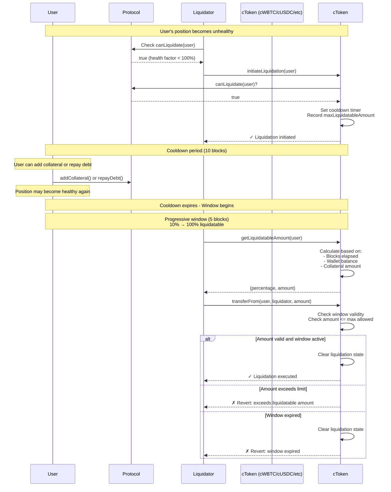
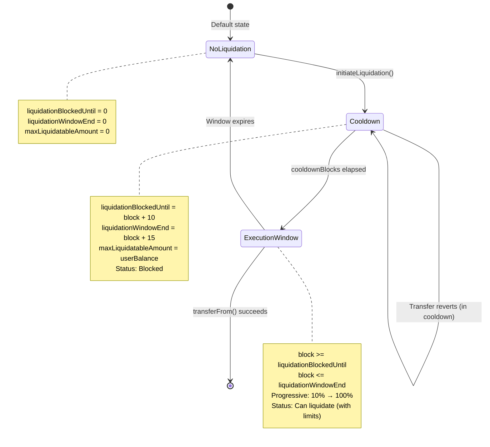

# Circuit Breaker Token

## Abstract

Circuit Breaker Token is a wrapped token implementation that introduces a **progressive time-delayed liquidation mechanism** to protect users from instant liquidations in DeFi lending protocols. By enforcing a mandatory cooldown period followed by a gradual liquidation window, users gain time to react and potentially save their positions, while still ensuring that legitimately unhealthy positions can eventually be liquidated.

The implementation is **generic and can wrap any ERC20 token** - examples include cWBTC (wrapped WBTC), cUSDC (wrapped USDC), cDAI (wrapped DAI), etc. The "c" prefix stands for "circuit breaker."

### Key Features

1. **Progressive Liquidation Curve**: Liquidatable amount increases from 10% to 100% over the execution window
2. **Wallet Balance Consideration**: Users with available tokens can get additional time (reduced liquidation percentage)
3. **Collateral-Aware**: Takes into account the user's total collateral position
4. **Two-Phase System**: Initiation (with cooldown) → Progressive execution window

## Introduction

### The Problem

In current DeFi lending protocols (Aave, Compound, etc.), liquidations happen instantaneously when a position becomes unhealthy. This creates several issues:

1. **Flash Crashes**: Temporary price volatility can trigger liquidations even when the underlying position is fundamentally sound
2. **No User Response Time**: Users have zero time to add collateral or repay debt once their position becomes liquidatable
3. **MEV Exploitation**: Liquidators often use sophisticated MEV techniques to front-run user transactions attempting to save their positions
4. **Liquidation Storms** ⚠️: The most critical problem - cascading liquidations create self-reinforcing death spirals:
   - Position A gets liquidated → collateral is sold → price drops slightly
   - Price drop makes Position B liquidatable → more selling → price drops further
   - This triggers Position C, D, E... creating an accelerating cascade
   - **Key insight**: In these events, there are very few genuine sellers - it's mostly forced liquidations triggering more forced liquidations
   - The market doesn't have time to find natural buyers, leading to artificial price suppression
   - By the time the cascade stops, prices may have dropped 20-40% from levels where genuine market demand would have provided support

### Example Scenarios

#### Individual Liquidation
```
Block N:   User has 150% health factor (healthy)
Block N+1: Price drops, health factor → 95% (liquidatable)
Block N+1: Liquidator immediately liquidates entire position
Block N+2: User's transaction to add collateral arrives (too late)
```

The user had no realistic opportunity to save their position.

#### Liquidation Storm (The Real Problem)
```
Block N:   ETH = $2000, 1000 positions healthy
Block N+1: Small sell pressure → ETH = $1980
           50 positions become liquidatable → liquidated immediately
           Forced selling of 500 ETH → ETH = $1940
           
Block N+2: 200 more positions now liquidatable → liquidated immediately
           Forced selling of 2000 ETH → ETH = $1860
           
Block N+3: 400 positions liquidatable → ETH = $1720
           ...cascade continues...
           
Block N+10: ETH = $1200 (40% drop)
            Actually very few genuine sellers - mostly forced liquidations
            Natural buyers would have stepped in at $1800-$1900
            But cascade happened too fast for market to stabilize
```

This is not a functioning market - it's a technical failure mode where the protocol's design creates artificial downward pressure.

## Solution

The Circuit Breaker Token implements a **two-phase progressive liquidation process** with a mandatory cooldown period that breaks the liquidation storm cycle.

### Overview

The system works in two phases:
1. **Initiation Phase**: Anyone can initiate liquidation for an unhealthy position, triggering a cooldown timer
2. **Progressive Execution Phase**: After cooldown, liquidation becomes possible with an increasing percentage over time

### Why This Approach?

**We cannot modify existing lending protocols.** Major protocols like Aave, Compound, and Maker are governed by DAOs and have billions in TVL. Changing their core liquidation logic would require:
- Extensive governance proposals and voting
- Months or years of debate and auditing
- Risk of breaking existing integrations
- Potential security vulnerabilities from core changes

**Instead, we use a wrapper token approach:**
- Circuit breaker tokens (cWBTC, cUSDC, cDAI, etc.) wrap existing tokens with protection functionality
- Lending protocols treat them as any other ERC20 collateral token
- No changes needed to protocol code
- Can be deployed and adopted immediately
- Users opt-in by choosing to use wrapped versions (cWBTC instead of WBTC, cUSDC instead of USDC, etc.)

### Protocol Compatibility

Different lending protocols have different requirements for adding new collateral tokens:

| Protocol | Type | Collateral Addition | Timeline | Notes |
|----------|------|---------------------|----------|-------|
| **Aave V3** | DAO-Governed | Requires governance vote | Weeks-Months | Must pass risk assessment, community vote |
| **Compound V3** | DAO-Governed | Requires governance proposal | Weeks-Months | COMP holders vote on new collateral |
| **Maker** | DAO-Governed | Requires governance vote | Months | Extensive risk analysis required |
| **Morpho** | Permissionless | Instant deployment | Immediate | Can create markets for any ERC20 |
| **Euler V2** | Permissionless | Instant deployment | Immediate | Permissionless vault creation |
| **Silo Finance** | Permissionless | Instant deployment | Immediate | Isolated lending markets per asset |
| **Radiant** | DAO-Governed | Requires governance vote | Weeks | Aave V2 fork with similar governance |
| **Elara (Zircuit)** | Permissionless | Instant deployment | Immediate | Zerolend fork, supports ERC20 markets |
| **Purrlend (Zircuit)** | Permissionless | Instant deployment | Immediate | Zerolend fork, isolated markets |
| **Lambdalend** | Permissionless | Instant deployment | Immediate | Features gradual liquidation (inspiration for this project) |
| **Money on Chain (Rootstock)** | Stablecoin Protocol | Custom integration | Varies | Dollar on Chain stablecoin with Queue & Flux Capacitor gradual liquidation |

**Immediate Deployment Options:**
Protocols like Morpho, Euler V2, Silo Finance, Elara, Purrlend, and Lambdalend allow permissionless market creation, meaning circuit breaker tokens (cWBTC, cUSDC, etc.) can be deployed and used immediately without any governance approval.

**DAO Approval Options:**
For major protocols like Aave and Compound, a governance proposal highlighting the liquidation storm protection would be needed. Multiple tokens can be proposed together (e.g., cWBTC, cUSDC, cDAI) or individually.

**Note on Citrea:**
Citrea is currently in testnet phase with no production lending protocols deployed yet. Circuit breaker tokens can be deployed once lending protocols launch on mainnet.

### Phase 1: Initiation & Cooldown

Anyone can initiate liquidation for an unhealthy position, starting a **cooldown timer** (e.g., 10 blocks ≈ 2 minutes on Ethereum).

**During cooldown:**
- Users can add collateral or repay debt to save their positions
- Natural market buyers have time to step in and stabilize prices
- The cascade is broken - liquidations don't trigger instantly
- Price discovery can happen at more rational levels

**Snapshot at initiation:** The system records the user's balance at initiation time as `maxLiquidatableAmount`. This prevents gaming by transferring tokens during cooldown.

### Phase 2: Progressive Execution Window

After the cooldown expires, liquidation becomes possible with a **progressive percentage curve** over a limited window (e.g., 5 blocks):

#### Progressive Liquidation Curve

The liquidatable percentage starts at **10%** and increases linearly to **100%** over the execution window:

```
Percentage = 10% + (90% × blocks_into_window / window_size)
```

**Example with 5-block window:**

| Block in Window | Base % | Amount (of 1000 tokens) |
|----------------|--------|-------------------------|
| 0 (start) | 10% | 100 tokens |
| 1 | 28% | 280 tokens |
| 2 | 46% | 460 tokens |
| 3 | 64% | 640 tokens |
| 4 | 82% | 820 tokens |
| 5 (end) | 100% | 1000 tokens |

**Benefits:**
- **Gradual approach**: Users have multiple opportunities to add collateral incrementally
- **Market stability**: Prevents large instant liquidations that crash prices
- **Liquidator incentive**: Early action rewarded with access to smaller amounts; waiting gets more but risks window expiry
- **Fairness**: User maintains partial position even if they can't fully save it

#### Wallet Balance Protection Cap (Time-Decay)

The system checks the user's **wallet balance** of the underlying token to **initially cap the maximum liquidatable percentage**, giving users with available funds a grace period. However, **the cap decays over time** to ensure users who refuse to act eventually face full liquidation:

```solidity
uint256 maxAllowedPct = 100%;  // Default
uint256 baseCap;

if (walletBalance > 0 && userCollateral > 0) {
    walletToCollateralRatio = (walletBalance × 100) / userCollateral
    
    // Determine initial cap based on wallet balance
    if (walletToCollateralRatio >= 100%) {
        baseCap = 50%   // Start at 50% if user has enough to fully cover
    } else if (walletToCollateralRatio >= 50%) {
        baseCap = 70%   // Start at 70% if user has significant funds
    } else {
        baseCap = 100%  // No protection if insufficient funds
    }
    
    // Decay the protection: cap increases from baseCap to 100% over window
    if (baseCap < 100%) {
        capIncrease = ((100% - baseCap) × blocks_into_window) / window_size
        maxAllowedPct = baseCap + capIncrease
    }
}

finalPercentage = min(basePercentage, maxAllowedPct)
```

**Example Scenarios with Time Decay:**

**Scenario 1: User with 60% wallet balance (baseCap = 70%)**

| Block | Base % | Cap % (70→100) | Final % | Amount (of 1000) |
|-------|--------|----------------|---------|------------------|
| 0 | 10% | 70% | **10%** | 100 tokens |
| 1 | 28% | 76% | **28%** | 280 tokens |
| 2 | 46% | 82% | **46%** | 460 tokens |
| 3 | 64% | 88% | **64%** | 640 tokens |
| 4 | 82% | 94% | **82%** | 820 tokens |
| 5 | 100% | 100% | **100%** | 1000 tokens |

**Scenario 2: User with 120% wallet balance (baseCap = 50%)**

| Block | Base % | Cap % (50→100) | Final % | Amount (of 1000) |
|-------|--------|----------------|---------|------------------|
| 0 | 10% | 50% | **10%** | 100 tokens |
| 1 | 28% | 60% | **28%** | 280 tokens |
| 2 | 46% | 70% | **46%** | 460 tokens |
| 3 | 64% | 80% | **64%** | 640 tokens |
| 4 | 82% | 90% | **82%** | 820 tokens |
| 5 | 100% | 100% | **100%** | 1000 tokens |

**Key Point:** The cap provides **early protection** but **decays to allow full liquidation** by the end of the window. This balances user protection with protocol security.

**Rationale:** 
1. **Grace Period**: Users with funds get extra time at the start (lower percentages)
2. **Incentive to Act**: If users don't add collateral, protection diminishes
3. **No Permanent Advantage**: Users who refuse to act despite having funds eventually face full liquidation
4. **Fair to Protocol**: Lenders aren't indefinitely exposed to undercollateralized positions
5. **Fair to Liquidators**: They can eventually liquidate the full amount if user doesn't respond

**User Strategy:**
- **Early in window (blocks 0-2)**: Protected from large liquidations, have time to assess and add collateral
- **Mid window (blocks 2-4)**: Protection decaying, should act if want to save position  
- **Late in window (block 5)**: No protection remains, must have acted by now

#### Window Expiration

If no liquidation occurs within the window, the entire process **resets**:
- All state is cleared (`liquidationBlockedUntil`, `liquidationWindowEnd`, `maxLiquidatableAmount`)
- Position must be re-evaluated with `canLiquidate()` before re-initiating
- This ensures stale liquidations can't be executed after a position recovers

### How This Prevents Liquidation Storms

**Without circuit breaker:**
```
Block N:   ETH = $2000, 1000 positions healthy
Block N+1: Price drops to $1980 → 50 positions liquidated instantly
           → Forced selling crashes price to $1940
Block N+2: 200 more positions liquidated → Price at $1860
Block N+3: Cascade continues... → Price at $1720
Result:    Artificial crash due to forced selling spiral
```

**With circuit breaker:**
```
Block N:   ETH = $2000, 1000 positions healthy
Block N+1: Price drops to $1980 → 50 liquidations initiated (10-block cooldown starts)
Block N+2-11: Users add collateral from wallets, 40 positions saved
Block N+11: Window opens, only 10% of remaining 10 positions liquidatable
           → Users with wallet balances have lower caps (50-70% vs 100%)
           → Minimal selling pressure (1 position, 10% liquidated)
Block N+12-16: Progressive liquidation with time-decaying wallet caps
           → Early blocks: Protected (caps at 50-70%)
           → Later blocks: Protection decays as users have had time to act
           → Users who act save positions; those who don't face full liquidation by end
           → Natural price discovery, market buyers step in
Result:    Most positions saved during cooldown. Users with funds get grace period
           but must act. Only truly overleveraged or unresponsive users fully liquidated.
```

**Result:** Instead of 1000 positions 100% liquidating instantly, the system:
1. Spreads liquidations over time (cooldown + progressive window)
2. Gives users with wallet balances extra protection early in the window
3. Decays protection over time to ensure users who refuse to act still get liquidated
4. Only fully liquidates positions that are fundamentally overleveraged OR where users had funds but chose not to act

### Trade-off: Interest Rate Adjustment

**Important:** This protection comes with a cost. Protocols using circuit breaker tokens should charge a **slightly higher interest rate** (e.g., +0.5-1% APR) to compensate for:

1. **Delayed liquidations**: If a price drop is genuine and sustained (not a storm), liquidators must wait through the cooldown
2. **Potential undercollateralization**: In a real market crash, the delay could result in underwater positions
3. **Liquidator compensation**: The added complexity and risk requires incentivizing liquidators

This is a **fair trade**: users pay marginally more in normal times to avoid catastrophic losses during cascades. Think of it as insurance against liquidation storms.



### State Machine



### Timeline Visualization

```mermaid
gantt
    title Liquidation Timeline (10 block cooldown, 5 block progressive window)
    dateFormat X
    axisFormat Block %L
    
    section Position Status
    Healthy Position          :done, 0, 2
    Unhealthy Position        :active, 2, 16
    
    section Liquidation State
    Initiation (Block 2)      :milestone, 2, 0
    Cooldown Period           :crit, 2, 10
    10% Liquidatable          :active, 12, 1
    28% Liquidatable          :active, 13, 1
    46% Liquidatable          :active, 14, 1
    64% Liquidatable          :active, 15, 1
    82% Liquidatable          :active, 16, 1
    100% Liquidatable         :active, 17, 1
    Window Expired            :done, 18, 2
    
    section Actions
    User can save position    :active, 2, 10
    Progressive liquidation   :crit, 12, 6
    Must re-initiate          :done, 18, 2
```



## Implementation Notes

### Progressive Liquidation Mechanism

The circuit breaker implements a **progressive liquidation curve** that gradually increases the liquidatable amount over time:

#### Liquidation Percentage Calculation

```
Base Percentage = MIN (10%) + (MAX (100%) - MIN (10%)) × (blocks_elapsed / window_size)
                = 10% + 90% × (blocks_elapsed / 5)
```

**Example Timeline (5-block window):**
- Block 0 of window: 10% liquidatable
- Block 1 of window: 28% liquidatable  
- Block 2 of window: 46% liquidatable
- Block 3 of window: 64% liquidatable
- Block 4 of window: 82% liquidatable
- Block 5 of window: 100% liquidatable

#### Wallet Balance Adjustment

The system checks the user's **wallet balance** of the underlying token to give users with available funds additional time:

```solidity
if (walletBalance > 0 && userCollateral > 0) {
    walletToCollateralRatio = (walletBalance × 100) / userCollateral
    
    if (walletToCollateralRatio > 50%) {
        reduction = (walletToCollateralRatio × percentage) / 300  // Max 33% reduction
        adjustedPercentage = percentage - reduction
    }
}
```

**Example:** User with 600 underlying tokens in wallet and 1000 collateral:
- Wallet/Collateral ratio = 60%
- At block 0 (10% base): Reduction = 60% × 10% / 300 = 2% → Final = 8%
- At block 2 (46% base): Reduction = 60% × 46% / 300 = 9.2% → Final = 36.8%

This rewards users who have the **ability to add collateral** by giving them more time.

#### Benefits of Progressive Liquidation

1. **User Protection**: Users have time to add collateral incrementally
2. **Market Stability**: Prevents large instant liquidations from crashing prices
3. **Incentive Alignment**: Liquidators are rewarded for acting quickly (higher percentage)
4. **Fairness**: Users with available funds get more protection

### Core Components

#### 1. Circuit Breaker Token Contract

A generic ERC20 wrapper that adds circuit breaker functionality to any underlying token:

**Example Implementations:**
- `cWBTC` - Circuit breaker wrapped WBTC
- `cUSDC` - Circuit breaker wrapped USDC  
- `cDAI` - Circuit breaker wrapped DAI
- Any ERC20 can be wrapped

- **Storage**:
  - `approvalBlock`: Tracks the block number of each approval (for user deposit detection)
  - `liquidationBlockedUntil`: Block number when liquidation becomes possible
  - `liquidationWindowEnd`: Block number when liquidation window expires
  - `maxLiquidatableAmount`: Maximum amount that can be liquidated (set at initiation)
  - `cooldownBlocks`: Immutable cooldown duration (e.g., 10 blocks)
  - `liquidationWindow`: Immutable window duration (e.g., 5 blocks)
  - `liquidationTarget`: Protocol contract that implements `canLiquidate()` and `getUserCollateral()`

- **Key Functions**:
  ```solidity
  function initiateLiquidation(address user) external
  function getLiquidatableAmount(address user) public view returns (uint256 percentage, uint256 amount)
  function _update(address from, address to, uint256 amount) internal override
  ```

#### 2. ILiquidationTarget Interface

Protocols must implement this interface to determine liquidation eligibility and provide collateral information:

```solidity
interface ILiquidationTarget {
    function canLiquidate(address user) external view returns (bool);
    function getUserCollateral(address user) external view returns (uint256);
}
```

Example implementation:
```solidity
contract LendingProtocol is ILiquidationTarget {
    mapping(address => uint256) public healthFactor;
    mapping(address => uint256) public userCollateral;
    
    function canLiquidate(address user) external view returns (bool) {
        return healthFactor[user] < LIQUIDATION_THRESHOLD; // e.g., < 100%
    }
    
    function getUserCollateral(address user) external view returns (uint256) {
        return userCollateral[user]; // Used for progressive liquidation calculation
    }
}
```

#### 3. User Deposit Detection

To allow normal user deposits without triggering the circuit breaker, the contract detects same-block approval + transfer patterns:

```solidity
// User approves and deposits in the same block
vm.prank(user);
token.approve(protocol, amount);
token.transferFrom(user, protocol, amount); // ✓ Allowed (same block)
```

### Security Considerations

1. **Same-block bypass**: User deposits (approve + transfer in same block) bypass the circuit breaker
2. **Window expiration**: Prevents indefinite liquidation rights; must re-check eligibility
3. **Race conditions**: Multiple liquidators can initiate, but only one can execute (first-come-first-served)
4. **Position recovery**: Users can save positions during cooldown, but existing liquidation window remains valid
5. **Interest rate compensation**: Protocols must charge higher rates to offset liquidation delay risk (see [Trade-off section](#trade-off-interest-rate-adjustment))

### Gas Optimization

- Immutable parameters (`cooldownBlocks`, `liquidationWindow`, `liquidationTarget`) save gas
- State cleanup on successful liquidation or window expiry
- No loops or unbounded operations

### Deployment Parameters

Recommended values (adjust based on network and use case):

| Network | Cooldown | Window | Interest Premium | Reasoning |
|---------|----------|--------|------------------|-----------|
| Ethereum Mainnet | 10 blocks (~2 min) | 5 blocks (~1 min) | +0.5-1% APR | Balance protection vs. liquidation efficiency |
| L2s (Optimism, Arbitrum) | 50 blocks (~2 min) | 25 blocks (~1 min) | +0.3-0.7% APR | Faster block times |
| Development/Testing | 5 blocks | 3 blocks | N/A | Quick iteration |

**Note on Interest Premium**: The additional interest compensates lenders for the increased risk that comes with delayed liquidations. During genuine market crashes (not liquidation storms), the protocol bears slightly more risk of undercollateralized positions.

### Integration Example

```solidity
// 1. Deploy your protocol
LendingProtocol protocol = new LendingProtocol();

// 2. Deploy circuit breaker tokens with your protocol as the liquidation target
CircuitBreakerToken cWBTC = new CircuitBreakerToken(
    "Circuit Breaker WBTC",
    "cWBTC",
    address(WBTC),         // underlying token
    10,                    // cooldownBlocks
    5,                     // liquidationWindow  
    address(protocol)      // liquidationTarget
);

CircuitBreakerToken cUSDC = new CircuitBreakerToken(
    "Circuit Breaker USDC",
    "cUSDC",
    address(USDC),         // underlying token
    10,                    // cooldownBlocks
    5,                     // liquidationWindow  
    address(protocol)      // liquidationTarget
);

// 3. Users wrap their tokens
WBTC.approve(address(cWBTC), amount);
cWBTC.deposit(amount);  // Wrap WBTC → cWBTC

// 4. Users deposit wrapped collateral
cWBTC.approve(address(protocol), amount);
protocol.deposit(cWBTC, amount);

// 5. When position becomes unhealthy
liquidator.initiateLiquidation(user);      // Start cooldown
// ... wait 10 blocks ...
liquidator.liquidate(user, amount);        // Execute liquidation
```

### Deployment Strategy

**For Permissionless Protocols (Immediate):**
1. Deploy circuit breaker token contracts (cWBTC, cUSDC, cDAI, etc.)
2. Create lending markets (e.g., on Morpho or Euler V2)
3. Users can start using wrapped tokens as collateral immediately
4. Market tests the concept with real usage

**For DAO-Governed Protocols (Governance Required):**
1. Deploy circuit breaker token contracts
2. Gather usage data from permissionless deployments
3. Create governance proposal with:
   - Liquidation storm problem analysis
   - Circuit breaker solution explanation
   - Interest rate premium justification (+0.5-1% APR)
   - Risk assessment and audit results
   - Proposal can include multiple tokens (cWBTC + cUSDC + cDAI) or single token
4. Community discussion and vote
5. If approved, circuit breaker tokens become accepted collateral

**Adoption Path:**
```
Phase 1: Launch on permissionless protocols (Morpho, Euler, Silo)
         → Deploy cWBTC, cUSDC, cDAI
         → Prove concept, gather data, build community

Phase 2: Governance proposals to major protocols (Aave, Compound)
         → Use Phase 1 data to demonstrate value
         → Propose most popular tokens first (cWBTC likely)

Phase 3: Widespread adoption as users prefer cascade-resistant collateral
         → Expand to more wrapped tokens (cLINK, cSTETH, etc.)
```

### Testing

Run the test suite:
```bash
forge test -vv
```

Test coverage includes:
- User deposit flows (unaffected by circuit breaker)
- Healthy position protection (cannot initiate liquidation)
- Full liquidation cycle (initiate → cooldown → execute)
- Window expiration and re-initiation
- Multiple liquidators competing
- Position recovery during cooldown

### Limitations

1. **Not a complete solution**: Users still need to monitor their positions and respond during the cooldown
2. **Gas costs**: Adds overhead compared to instant liquidations
3. **Liquidation delay**: Protocols may require higher collateralization ratios to account for the delay
4. **Wrapping required**: Users must wrap tokens (WBTC → cWBTC) adding a transaction step
5. **Adoption required**: Only effective if users choose wrapped versions - requires market education
6. **Governance friction**: Major protocols require governance approval, which takes time
7. **Fragmented liquidity**: Each wrapped token (cWBTC, cUSDC, etc.) has separate liquidity from underlying

### Future Improvements

- [ ] Support for multiple liquidation targets per token
- [ ] Configurable cooldown per user (based on position size or history)
- [ ] Partial liquidation support during window
- [ ] Event monitoring and notification system
- [ ] Integration with common lending protocol interfaces (Aave, Compound)
- [ ] Governance-adjustable parameters
- [ ] Emergency pause mechanism
- [ ] Template governance proposals for major protocols
- [ ] Dashboard showing circuit breaker vs. regular token liquidation statistics
- [ ] Automated wrapping/unwrapping through aggregators
- [ ] Batch deployment script for multiple wrapped tokens

## Related Work & Inspiration

This project builds upon and is inspired by existing gradual liquidation mechanisms in DeFi:

### Lambdalend
**Lambdalend** pioneered the concept of gradual liquidation in lending protocols. Their approach demonstrated that progressive liquidation can significantly reduce liquidation cascade risks while maintaining protocol solvency. This Circuit Breaker Token implementation extends that idea by:
- Making it **protocol-agnostic** through wrapped tokens
- Adding **wallet balance consideration** for users with available funds
- Implementing a **two-phase system** (cooldown + progressive execution)
- Enabling **permissionless deployment** on any lending protocol

### Money on Chain (Rootstock)
**Money on Chain's Dollar on Chain** stablecoin system implements sophisticated gradual liquidation mechanisms:

- **Queue System**: Liquidations are queued rather than executed instantly, allowing time for market stabilization and user response
- **Flux Capacitor**: Manages the rate of liquidations to prevent sudden market shocks, spreading liquidations over time

These mechanisms inspired the time-decay and progressive percentage features in Circuit Breaker Token, adapted for wrapped ERC20 collateral rather than stablecoin-specific use cases.

### Key Innovations
While inspired by these projects, Circuit Breaker Token introduces:
1. **Universal applicability**: Works with any ERC20 token and any lending protocol
2. **Wrapper approach**: No protocol modifications needed
3. **Time-decay caps**: Balances user protection with protocol security
4. **Permissionless deployment**: Can be deployed immediately on compatible protocols

## License

MIT

## Contributing

See [CONTRIBUTING.md](CONTRIBUTING.md) for development setup and contribution guidelines.
