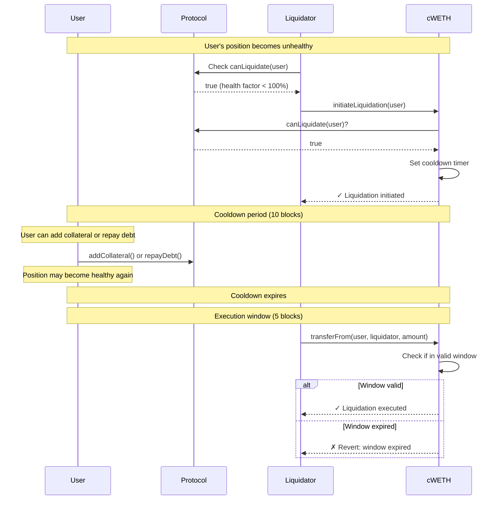
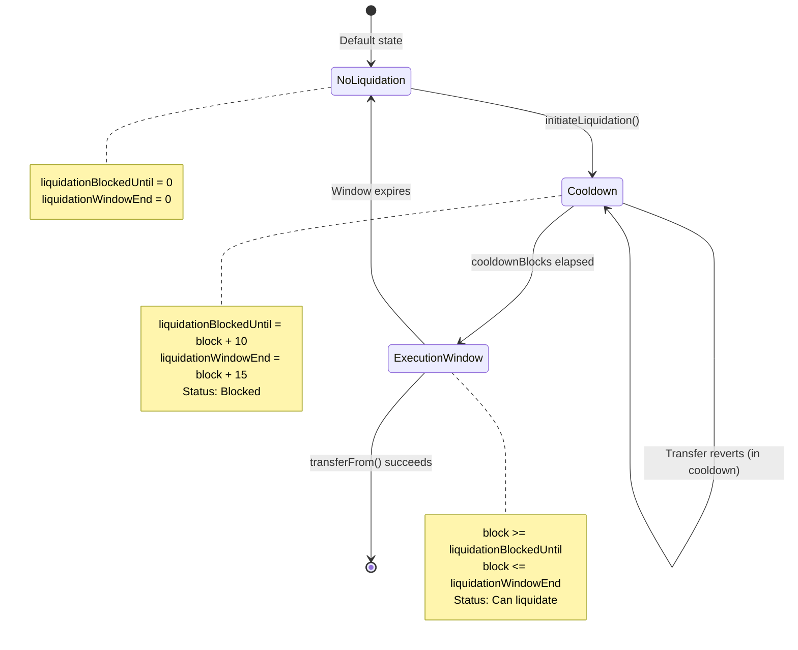

# Circuit Breaker Token (cWETH)

## Abstract

Circuit Breaker Token (cWETH) is a wrapped token implementation that introduces a time-delayed liquidation mechanism to protect users from instant liquidations in DeFi lending protocols. By enforcing a mandatory cooldown period between liquidation initiation and execution, users gain time to react and potentially save their positions, while still ensuring that legitimately unhealthy positions can eventually be liquidated.

## Introduction

### The Problem

In current DeFi lending protocols (Aave, Compound, etc.), liquidations happen instantaneously when a position becomes unhealthy. This creates several issues:

1. **Flash Crashes**: Temporary price volatility can trigger liquidations even when the underlying position is fundamentally sound
2. **No User Response Time**: Users have zero time to add collateral or repay debt once their position becomes liquidatable
3. **MEV Exploitation**: Liquidators often use sophisticated MEV techniques to front-run user transactions attempting to save their positions
4. **Cascading Liquidations**: Market downturns can trigger waves of liquidations that further depress prices

### Example Scenario

```
Block N:   User has 150% health factor (healthy)
Block N+1: Price drops, health factor → 95% (liquidatable)
Block N+1: Liquidator immediately liquidates entire position
Block N+2: User's transaction to add collateral arrives (too late)
```

The user had no realistic opportunity to save their position.

## Solution

The Circuit Breaker Token implements a **two-phase liquidation process** with a mandatory cooldown period:

### Phase 1: Initiation
Anyone can initiate liquidation for an unhealthy position, starting a cooldown timer (e.g., 10 blocks ≈ 2 minutes on Ethereum).

### Phase 2: Execution Window
After the cooldown expires, there's a limited time window (e.g., 5 blocks) during which the liquidation can be executed. If not executed in time, the process must be re-initiated.



### State Machine



### Timeline Visualization

```mermaid
gantt
    title Liquidation Timeline (10 block cooldown, 5 block window)
    dateFormat X
    axisFormat Block %L
    
    section Position Status
    Healthy Position          :done, 0, 2
    Unhealthy Position        :active, 2, 16
    
    section Liquidation State
    Initiation (Block 2)      :milestone, 2, 0
    Cooldown Period           :crit, 2, 10
    Execution Window          :active, 12, 5
    Window Expired            :done, 17, 2
    
    section Actions
    User can save position    :active, 2, 10
    Liquidator can execute    :crit, 12, 5
    Must re-initiate          :done, 17, 2
```



## Implementation Notes

### Core Components

#### 1. cWETH Token Contract

The main token contract that extends ERC20 with circuit breaker functionality:

- **Storage**:
  - `approvalBlock`: Tracks the block number of each approval (for user deposit detection)
  - `liquidationBlockedUntil`: Block number when liquidation becomes possible
  - `liquidationWindowEnd`: Block number when liquidation window expires
  - `cooldownBlocks`: Immutable cooldown duration (e.g., 10 blocks)
  - `liquidationWindow`: Immutable window duration (e.g., 5 blocks)
  - `liquidationTarget`: Protocol contract that implements `canLiquidate()`

- **Key Functions**:
  ```solidity
  function initiateLiquidation(address user) external
  function _update(address from, address to, uint256 amount) internal override
  ```

#### 2. ILiquidationTarget Interface

Protocols must implement this interface to determine liquidation eligibility:

```solidity
interface ILiquidationTarget {
    function canLiquidate(address user) external view returns (bool);
}
```

Example implementation:
```solidity
contract LendingProtocol is ILiquidationTarget {
    function canLiquidate(address user) external view returns (bool) {
        return healthFactor[user] < LIQUIDATION_THRESHOLD; // e.g., < 100%
    }
}
```

#### 3. User Deposit Detection

To allow normal user deposits without triggering the circuit breaker, the contract detects same-block approval + transfer patterns:

```solidity
// User approves and deposits in the same block
vm.prank(user);
token.approve(protocol, amount);
token.transferFrom(user, protocol, amount); // ✓ Allowed (same block)
```

### Security Considerations

1. **Same-block bypass**: User deposits (approve + transfer in same block) bypass the circuit breaker
2. **Window expiration**: Prevents indefinite liquidation rights; must re-check eligibility
3. **Race conditions**: Multiple liquidators can initiate, but only one can execute (first-come-first-served)
4. **Position recovery**: Users can save positions during cooldown, but existing liquidation window remains valid

### Gas Optimization

- Immutable parameters (`cooldownBlocks`, `liquidationWindow`, `liquidationTarget`) save gas
- State cleanup on successful liquidation or window expiry
- No loops or unbounded operations

### Deployment Parameters

Recommended values (adjust based on network and use case):

| Network | Cooldown | Window | Reasoning |
|---------|----------|--------|-----------|
| Ethereum Mainnet | 10 blocks (~2 min) | 5 blocks (~1 min) | Balance protection vs. liquidation efficiency |
| L2s (Optimism, Arbitrum) | 50 blocks (~2 min) | 25 blocks (~1 min) | Faster block times |
| Development/Testing | 5 blocks | 3 blocks | Quick iteration |

### Integration Example

```solidity
// 1. Deploy your protocol
LendingProtocol protocol = new LendingProtocol();

// 2. Deploy cWETH with your protocol as the liquidation target
cWETH token = new cWETH(
    10,                    // cooldownBlocks
    5,                     // liquidationWindow  
    address(protocol)      // liquidationTarget
);

// 3. Users deposit collateral
user.approve(address(protocol), amount);
protocol.deposit(token, amount);

// 4. When position becomes unhealthy
liquidator.initiateLiquidation(user);      // Start cooldown
// ... wait 10 blocks ...
liquidator.liquidate(user, amount);        // Execute liquidation
```

### Testing

Run the test suite:
```bash
forge test -vv
```

Test coverage includes:
- User deposit flows (unaffected by circuit breaker)
- Healthy position protection (cannot initiate liquidation)
- Full liquidation cycle (initiate → cooldown → execute)
- Window expiration and re-initiation
- Multiple liquidators competing
- Position recovery during cooldown

### Limitations

1. **Not a complete solution**: Users still need to monitor their positions and respond during the cooldown
2. **Gas costs**: Adds overhead compared to instant liquidations
3. **Liquidation delay**: Protocols may require higher collateralization ratios to account for the delay
4. **Single collateral**: Current implementation focuses on one token; multi-collateral systems need adaptation

### Future Improvements

- [ ] Support for multiple liquidation targets
- [ ] Configurable cooldown per user (based on position size or history)
- [ ] Partial liquidation support during window
- [ ] Event monitoring and notification system
- [ ] Integration with common lending protocol interfaces (Aave, Compound)
- [ ] Governance-adjustable parameters
- [ ] Emergency pause mechanism

## License

MIT

## Contributing

See [CONTRIBUTING.md](CONTRIBUTING.md) for development setup and contribution guidelines.
